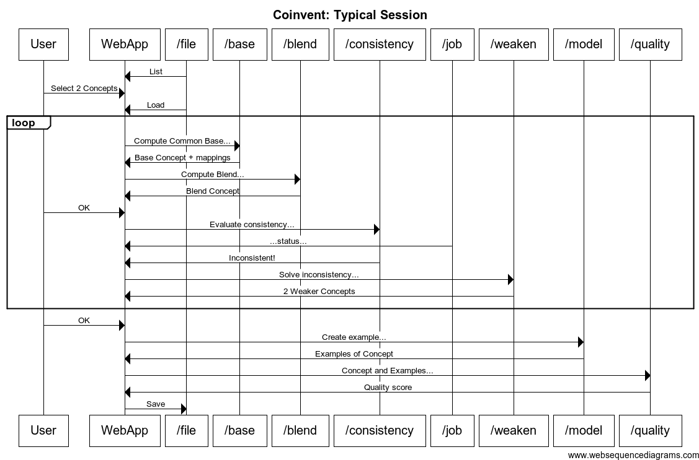
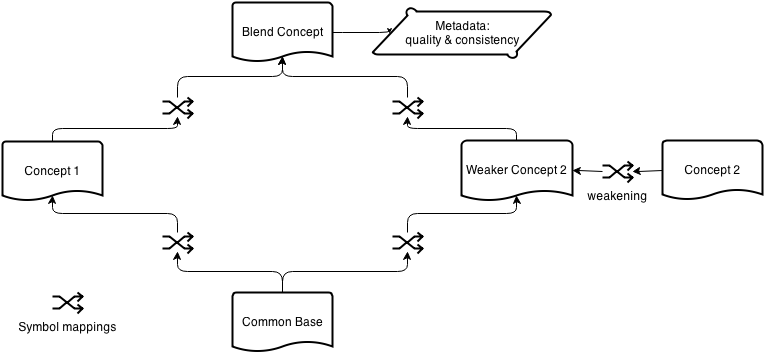

# Coinvent Architecture

Authors: Daniel Winterstein, Ewen Maclean, Mihai Codescu.
Status: Final Draft, due for delivery in June.   
Version: 1.0   

- [Overview](#overview)
- [A Typical Coinvent Session](#typical)
- [The Blend Diagram in Progress](#bdip)
- [Components](#components)
- [Architecture](#architecture)
- [Languages / File Formats](#languages)
- [Open Questions & Risks](#open)
- [References](#references)
- [Appendix 1: Component APIs](#appendix1)
- [Appendix 2: Requirements / User-Stories](#appendix2)
- [Appendix 3: Definitions / Glossary](#appendix3)

## Overview

This document presents the archictectural design for the integrated Coinvent system. 

Please first read:

1. The [Glossary](#appendix3)
2. The [requirements / user-stories](#appendix2) which motivate this design.

## A Typical Coinvent Session

Coinvent covers several domains and use-cases. The following description may be taken
as typical of planned usage, but not normative.

In a typical session, the user browses & selects two concepts from the 
rich background of domain concepts. A blended concept is then developed, which
may be automatic or interactive. Examples of the concept are generated (again, either
automatically or interactively, depending on the capability of the automatic software). Finally, the concept's quality is evaluated based on the examples.

This is illustrated in the UML sequence diagram below:

<!-- title Coinvent: Typical Session

Participant User
Participant WebApp

/file->WebApp: List
User->WebApp: Select 2 Concepts
/file->WebApp: Load
loop 
   WebApp->/base: Compute Common Base...
   /base->WebApp: Base Concept + mappings
   WebApp->/blend: Compute Blend...
   /blend->WebApp: Blend Concept
   User->WebApp: OK
   WebApp->/consistency: Evaluate consistency...
   /job->WebApp: ...status...
   /consistency->WebApp: Inconsistent!
   WebApp->/weaken: Solve inconsistency...
   /weaken->WebApp: 2 Weaker Concepts
end
User->WebApp: OK
WebApp->/model: Create example...
/model->WebApp: Examples of Concept
WebApp->/quality: Concept and Examples...
/quality->WebApp: Quality score
WebApp->/file: Save -->

## Core Object: The Blend Diagram in Progress

The object type at the heart of Coinvent is the Blend Diagram. The specification below is intentionally broad to support several use-cases. The Blend Diagram is illustrated in the flowchart diagram below:

<!-- source: BlendDiagram.xml and http://draw.io -->

Crucially we must support blend diagrams which are "works in progress". The high-level process of developing a new blended concept is:

1. Pick two concepts to blend.
2. Compute a common base concept.
3. Compute a blend.
4. Evaluate the blend for consistency.
5. ...Which may lead to changes in either the input concepts, such as logical weakenings to remove the conflict. This process of evaluate-modify could be iterated several times.
6. Evaluate the blend for value, perhaps by generating examples/models and evaluating them.
7. ...This evaluation may lead to modifications, and so the whole process is iterative.
??Till: Note that any proof of an inconsistency of the blend can give you hints which axioms to look at (namely, the axioms used in the inconsistency proof, cf. Pellet's “explain” function).
We should prepare for more complex models, where the global workflow is enriched with vision and debugging techniques, changing the input spaces if necessary, etc.??

Hence we talk of a Blend Diagram *in Progress* to allow that blends may be developed step-by-step and iteratively.

Concepts are defined in CASL or OWL. Mappings between concepts are defined in DOL. Metadata is also defined in DOL. The Blend Diagram may be a single file, or several linked files, using DOL's support for urls.

A `Blend Diagram` consists of:

1. A Blended Concept
2. A set of Input Concepts (typically 2)
3. Optionally, weakenings of the Input Concepts. E.g. a mapping Concept1 <- WeakerConcept1, by dropping symbols or sentences.
4. A Base Concept, which is a common base for all the Input Concepts. If there are weakenings, then the Base is a base for the weakened concepts (not the originals).
5. Mappings from the Base Concept to each of the (weakened) Input Concepts.
6. Mappings from each of the (weakened) Input Concepts to the Blended Concept.
7. Optional metadata about each of the Concepts, such as evaluation scores,  proof obligations, or relationship to other Concepts.
8. Optional metadata about the system setup, such as preferred component setup.

The Blended Concept *may* be a colimit, but it does not have to be.
The Base Concept *may* be found via anti-unification, but it does not have to be.

A `Blend Diagram in Progress` is simply a Blend Diagram where any part may be missing or incomplete, and Concepts do not have to be consistent. 

## Components

A Coinvent system will be made up of the following components.
A component can be "manual", which means a human being provides the result (using a web interface).

### User Portal (Web App)
An interface through which the user drives the system. This will be a web-app,
i.e. a browser-based ajax app.

A default user interface (UI) will be built on established toolkits, including Bootstrap, jQuery, and underscore.js.

As the project progresses other domain-specific UIs may be developed -- e.g. a music viewer & player, 
or a child-friendly UI if we cover the fictional-beasts domain. 
The architecture setup deliberately keeps the UI separate, accessing the processing components via the APIs, so that other UIs can be built and by anyone.

Default implementation: To be developed.

### /blend Concept Blender: Given a Blend Diagram in Progress, compute the Blend Concept

Default implementation: HETS

As well as producing blends, this component also outputs proof obligations.

The Blender does not have to compute consistency. This is the job of the Concept Correctness component.

The HETS API is currently still in development, and improvements are needed
before it fits all requirements. Specific open issues are logged here: <https://github.com/coinvent/coinvent/issues?labels=HETS&page=1&state=open>

### /base Given 2 Concepts, compute a common base Concept

This component finds a common base theory, and mappings to the input concepts. That is,
it fills in the bottom half of the blend diagram. 
The common base is not always unique -- there may be a choice of several.

A common base and mappings defines an analogy between the concepts. This component does not itself calculate the blend. However if a push-out based /blend component is used (as we envisage), then the base and mappings do uniquely determine the blend concept.

Default implementation: HDTP, which works via anti-unification.

Required work: HDTP currently uses a custom Prolog-based format. To plug into Coinvent (or HETS without Coinvent), a translation layer will be developed so that HDTP can take in OWL or CASL.

Note: HDTP will remain stateless. It will not itself manage sessions or run a web-server.

### /weaken Amalgam Finder: Given an inconsistent Blend Diagram, weaken the inputs

Initial implementation: manual

Since the colimit operation (and blending in general) can generate inconsistent blends, it may be necessary to weaken the input theories until a consistent blend is found. 

The Amalgams team will lead on this, exploring the generalization operation for amalgams described in [4], and developing a stand-alone Theory Weakener (TW).

The TW will not be capable of computing colimits itself; therefore it requires a feedback loop with HETS.

In case the colimit is inconsistent, the TW analyzes the input theories and the inconsistencies
in the blend and weakens the theories based on this information by removing sentences from the
input theories. This removal will be based on heuristics known from amalgam reasoning [4]. The whole procedure is repeated until a consistent colimit is found.

For the implementation of the TW, we are currently investigating using an 
Answer Set Programming (ASP) approach, calling on online ASP solvers. This allows us to (i) rapidly implement prototypes, 
(ii) make use of the highly optimized search problem algorithms that drive modern ASP solvers [2], and (iii) use the advantages of online ASP solvers like oclingo [1] that will re-use partial solutions of earlier weakenings. Towards this, a weakening operation is modeled as sequence of theory transitions, based on atomic operations that each affect the different types of sentences (eg. SubClassOf , EquivalentTo, ObjectProperty, etc. for OWL) within theories. Perceiving the theory weakening as a sequence of theory transitions also allows us to exploit the iterative problem solving capabilities of modern ASP solvers and to re-use coding strategies known from other kinds
of state transition based problems that are typically modeled in ASP [2].

### /model Example Finder: Given a Concept, find examples / models

This is a key part of creative blending, especially around evaluating a concept. 
It is noticeable that when people learn and evaluate concepts, they often do so via examples.

The meaning of "example" is domain specific.

In mathematical theories, an example is a model, which is itself a theory. 
E.g. in the complex numbers case-study (c.f. https://github.com/coinvent/coinvent/tree/master/HETS/complex_numbers), 
an example is the refined theory where `i^2 = -1` has been added to provide a constructive formula for the existential
axiom `\forall vectors x,y, \exists vector z, x*y = z` (note: in the .dol file, this existential axiom is 
implicit in * being a total function).
 
In musical theories, an example is a piece of music conforming to the theory.
 
The initial implementation will be manual. Automated implementations will often be domain specific (e.g. we may use a Hidden-Markov-Model based music generator), and may not be possible in all domains.
For relatively simple theories (e.g. small models to finite first-order theories), model-finders such as MACE can be used, possibly via HETS.

### /consistency Concept Correctness: Is it consistent?

Blending can lead to inconsistent concepts. HETS has support for using various theorem provers to check for consistency. However detecting inconsistency is not always
easy. In the complex numbers example, it has been found to require manually guided
proofs.

### /quality Concept Scorer: How good is a Concept?

A key part of creativity is judging the quality of the outputs; discarding
low-value concepts, and selecting valuable ones. How to do this is one of the research questions this project will explore. HR has automatic scores for detecting interesting concepts, which it would be interesting to incorporate.

Default implementation: Manual

### /file Concept Store: Store Concepts and Blend Diagrams

Must provide save and load over http.

Note that most of the other components do *not* depend on a dedicated storage component. They can work with concepts stored on *any* server, as long as the format is correct and the concept can be identified by url. The User Interface does require a file storage component to store blend diagrams as they're modified.

Default implementation: 

 - File-system backed. By adding git to the file-system we can provide integration with Ontohub.

### /job: Provide meta-data on slow tasks

As discussed in the [architecture section](#architecture), some of the system tasks are not suitable for
a fast blocking API. These tasks will create jobs, which run on the server until complete.
The /job component provides an API for fetching information on the state of the job queue and a specific job. This allows the web-portal (or other user interfaces) to see the state of a blend, and a way to
report on any errors.

## Architecture

### Independent components, linked via http APIs

Requirements:  

1. The components of the system may be developed in different languages.
2. The system should be easy to maintain and extend.
3. The system should support both interactive use, and repeatable scripted use.

Requirements (1) and (2) above suggest a loose coupling between components. The use of http-based APIs is an established way of achieving this. In particular, http-based APIs with a REST-like setup (i.e. the url follows a simple readable structure) and using JSON to encode data are now becoming the standard for modern software development. 

JSON will provide a wrapper for API-level information. JSON is not part of the file format for Blend Diagrams. Blend Diagrams are written in DOL + OWL or CASL, and sent within a JSON packet as JSON strings.

An added benefit of this architecture is that it provides flexibility regarding the hardware infrastructure. The components of the Coinvent system may be run either on a single server, or across multiple servers.

#### Supporting Alternative Component Implementations

To provide flexibility, especially across varied domains, the architecture is organised into separate
components. This document describes default implementations for each component.
However any component can be provided by an alternative implementation. Any system which fits the API for a Coinvent component slot, can fill that slot.

We envisage certain components will indeed have multiple implementations: HETS and HR3 are both candidates for the /blend and /consistency slots. The /model slot will benefit from domain-specific implementations (e.g. a music generator).

##### Component Setup

With the architecture supporting different implementations for components, the system
requires a setup describing which implementations to call.

Each component has a default implementation, which will be specified in a config file.

The Social Creativity strand of the Coinvent project requires that different setups
can be run and interact. In order to support this from within one server, we allow
that a Blend Diagram in Progress can carry meta-data about which component implementations to call (if different from the defaults). This meta-data might include implementation-specific configuration parameters.

#### Scripting the system

Requirement (3) relates to research users, who need to run repeatable concept development sessions. This requirement is met in this architecture by scripts which drive the API. Such scripts would most naturally be developed in javascript, perhaps using a test-runner. Indeed, the test scripts we develop as part of software QA will provide templates for scriptable use.

Where steps involve systems such as the interactive theorem prover Isabelle, it is an open question how we script such systems within Coinvent. HETS
has some support for this (call `hets -I` and enter "help"), 
although the HETS API does not expose it.

#### Software Wrapped as a Server

"Calculation" software such as HDTP will be incorporated into this framework using a server which "wraps" the low-level software. E.g. the other components connect to the HDTP-server over http, and the server manages calling HDTP itself.

#### Top-level Stateful, Low-level Stateless

Calculation software will be stateless. This is simpler, and avoids tying the
low-level components to the bigger system.

There's the question of: paging through results.
E.g. HDTP can produce multiple outputs for some inputs.
If we have one mapping & we want a 2nd or a 3rd -- how do we do that?   

This will be handled via input flags, and just repeating
the calculation asking for more outputs (i.e. iterative deepening).

The overall system will be stateful, because being stateful is the
most natural way to support several required features:

 - Slow tasks, where a job is started, runs, finishes later.
 - Interactive UI, where the user has a fixed reference point to view
a developing blend.

The state would be handled at the top level. The components
(HDTP, HETS-as-a-colimit-calculator, etc) are used in a stateless manner.

### Manual / Interactive Mode

The goal of the Coinvent system is to be semi-automatic. 
Certain components -- such as evaluating musical quality -- are best handled manually, at least
in this project. There are also components, such as consistency checking, where a fully-automatic solution is desirable, but for mathematically difficult theories, this may not be possible.
We therefore support a manual / interactive mode for each component.

This works as part of the actor model. Certain actors correspond to systems, e.g. the "hets" user
connects to the HETS system. Other actors correspond to people. For these actors, the UI
will show a list of open job requests sent to them, and an interface for responding to a job.
The user is then free to call on any outside tools they wish (e.g. working via another theorem prover)
in order to complete the job.

These responses will be stored, so that sessions can be re-played.

### Actor / Queue Pattern

Requirements:  

1. The components of the system call on each other to perform tasks...
2. ...but these tasks may be slow to complete. Since tasks may require human input (eg. a proof in an interactive theorem prover like Isabelle), a task
could even take days.

This means a standard call/response would timeout. We therefore adopt an actor / queue based pattern (see <https://en.wikipedia.org/wiki/Actor_model>). 

Each top-level component is an actor, which can send and receive messages to other actors. Each API request is marked as either *fast* or *slow*:

 - Fast messages get an immediate result within the http response.
 - Slow messages send an immediate receipt response with a job-id (using http code 202 "accepted for processing"), followed later by a result (which may indicate failure). This later message is either pushed via a callback, or pulled by polling.

### System Stack Diagram

<!--
Coinvent EcoSystem
[Default User Interface]
[AJAX][jQuery][underscore templates]
[Web browser]
[http: JSON format REST API]
[Java web-service wrapper]
[HDTP][Files][HETS server^1]
[SWI Prolog^2][Git^3][Theorem Provers]
[OS: Linux (Ubuntu)]
1: The HETS server provides an http API. This is lower-level than the Coinvent API.
2: HDTP might be re-written by Martin Möhrmann to use a different backend.
3: Git integration provides OntoHub integration without a hard dependency.   
-->

<table class="dia"><tbody><tr><td class="default" colspan="3">Default User Interface</td></tr><tr><td class="ajax" colspan="1">AJAX</td><td class="jquery" colspan="1">jQuery</td><td class="underscore" colspan="1">underscore templates</td></tr><tr><td class="web" colspan="3">Web browser</td></tr><tr><td class="http" colspan="3">http:  JSON format REST API</td></tr><tr><td class="java" colspan="3">Java web-service wrapper</td></tr><tr><td class="hdtp" colspan="1">HDTP</td><td class="files" colspan="1">Files</td><td class="hets" colspan="HETS server^1">HETS server1</td></tr><tr><td class="swi" colspan="SWI Prolog^2">SWI Prolog2</td><td class="git" colspan="Git^3">Git3</td><td class="theorem" colspan="1">Theorem Provers</td></tr><tr><td class="os" colspan="3">OS:  Linux <small>(Ubuntu)</small></td></tr></tbody></table><ul><li>1:  The HETS server provides an http API. This is lower-level than the Coinvent API.</li><li>2:  HDTP might be re-written by Martin Möhrmann to use a different backend.</li><li>3:  Git integration provides OntoHub integration without a hard dependency.</li></ul>

## Languages / File Formats

Coinvent will focus on human-readable text-file formats. 
A couple of formats for concepts will be supported, with the DOL language used to describe the connections between concepts.

### 3 Levels of languages: software, meta-logic, domain-logic

1. The outer language (json) is used to connect software components. E.g. specifying software inputs & callbacks, reporting on job-status, etc.
2. The meta-logic language (DOL) is used to describe the mappings between concepts.
3. The domain-logics (OWL, CASL) are used to describe actual concepts.

### Connecting concepts: DOL (modified)
DOL (Distributed Ontology, Modeling and Specification Language) is a language for describing how ontologies connect. 
DOL is currently in development by the OntolOp group. It is used by the HETS system. This integration with HETS makes it a good choice for Coinvent.

DOL is both larger than we need, and does not provide a couple of features we require. So we specify a modified version of DOL. We will work with the DOL team aiming to
converge on a true subset of DOL.

#### DOL subset: Supported Language Terms

Coinvent does not need all the features of DOL, and so we specify a reduced subset of DOL which should be used. Sticking to a smaller set reduces the learning curve for new Coinvent users.

Briefly, the supported symbols are:

 - `logic` Specify the Concept language, e.g. `logic OWL`
 - `ontology` Start defining a Concept.
 - `end` Finish defining a Concept. 
 - `view` Specify a mapping between Concepts, e.g. `view MyView : A to B =`
 - `with` Introduces a symbol mapping to rename symbols from a theory. A typical use in Coinvent would be as part of a combine statement.
 - `combine` Compute the colimit, e.g. `ontology B = combine I1, I2`
 - `hide` Used in a mapping to drop a symbol.
 - `=`
 - `:`
 - `,` List separator.
 - `|->` Part of a mapping, e.g. `zero |-> 0`
 - `%predicate(value)%` An annotation on a sentence. 
 - `%(label)%` A line label.
 - `%%` Starts a comment
 - `%implied` Marks a proof obligation (i.e. a statement which is required to be true, but has not been proved)

#### DOL: Extra Conventions and Language Terms
There are some features Coinvent needs which DOL does not yet provide (see the project's [GitHub issue tracker](https://github.com/coinvent/coinvent/issues?labels=DOL+%2F+file-formats)). Where possible, we fit these within the current DOL specification by specifying non-standard annotations.

1. Dropping symbols from a Concept: `hide` can be used when defining a mapping to drop sentences as well as symbols.

2. Marking inconsistent sentences: by the annotation `%inconsistent`

3. Marking relative importance of sentences: by the annotation `%importance(X)%`, where X is a number in the range [0,1]. The is interpreted by the /weaken component. How this is interpreted is not fixed, but it may be interpreted as a probability that the sentence holds.

4. Evaluating Concepts. That is, adding metadata which describes how good a concept is. Format TBD.
 
###  Mathematics: CASL

CASL is the first order logic language used by HETS. We will adopt it as the language Coinvent should use for mathematical concepts.

### Music: OWL?

The music team are investigating the use of OWL by producing a worked example of cadence blending.

It is anticipated that musical idioms will comprise both rules (e.g. constraints on a cadence) and statistical parts 
(e.g. hidden-markov-models).

### Other Domains: OWL Manchester Syntax

The established OWL description logic, via the Manchester Syntax, should be used for other domains.

### Web-service Wrapper: JSON

The web-service components (see below) will use JSON 
as a black-box wrapper, for web-services to
talk to each other. I.e. JSON is used to encode commands, such as "blend these concepts", and describe results, such as "success" or "failure due to timeout".

JSON is the best choice here, because it's a universal standard.

Low-level components (e.g. HDTP) will not take in JSON. That would be done by a
web-service wrapper, which then calls HDTP.

## Open Questions and Risks

Many development questions remain open at this stage in the project. Notable open questions are:

1. How to generate examples in the different domains.
2. How to use "3rd party systems" such as the Isabelle interactive theorem prover within Coinvent.
3. How to weaken theories to resolve inconsistencies?
3. What format is best for musical idioms?

### Software development risks & mitigation

Much of the Coinvent system builds upon existing components (HETS, HDTP, DOL), or can use standard software & approaches (the UI). These components therefore have a relatively low risk. That said, all the base components require some development to meet the needs of this project.

Higher risk components are /model and /weaken. How these functions can be implemented is a research topic. The problems are deep, and no readily adaptable solution exists. The team do have relevant expertise in techniques to tackle these tasks, but, as with any open-ended research task, there is a high level of technical risk.

To mitigate these risks, the system design allows for components to be fulfilled by manual interactive input. This means work on automated solutions to /model and /weaken is not a blocker for use of the system.

## References

 - CASL: [user manual](http://www.informatik.uni-bremen.de/cofi/wiki/index.php/CASL_user_manual)
 and [reference manual](http://www.informatik.uni-bremen.de/cofi/wiki/index.php/CASL_reference_manual)
 - DOL: <https://github.com/tillmo/DOL>
 - HDTP: <http://link.springer.com/chapter/10.1007%2F978-3-642-54516-0_7>
 - HETS: <http://www.informatik.uni-bremen.de/agbkb/forschung/formal_methods/CoFI/hets>
 - OWL Manchester Syntax: <http://www.w3.org/TR/owl2-manchester-syntax/>
 - ASP:
	1. M.Gebser et al, Engineering an Incremental ASP Solver. In International Converence on Logic Programming (2008), no. 1.
	2. M.Gebser et al, Answer Set Solving in Practice. Morgan and Claypool, 2012.
	3. M.Gelfond and V.Lifschitz, The Stable Model Semantics for Logic Programming.
In Proceedings of the International Conference on Logic Programming (ICLP) (1988).
	4. S.Ontan and E.Plaza, Amalgams: A formal approach for combining multiple case
solutions. In ICCBR (2010).
    

# Appendix 1: Component APIs

## Common

This document uses JSDoc to describe input and output types, e.g. `{?string}` would mark an optional string. For describing urls, $variable is used to mark a variable within a url.

### Url structure

The default server is coinvent.soda.sh and the default port is 8400.

For each component, we provide a default implementation, and these follow a
common url pattern.
Other implementations are possible, and may not follow the pattern.

	http://server:port/component/actor

This means we can have multiple different instances of a component, e.g.
http://coinvent.soda.sh:8400/blender/hets and http://coinvent.soda.sh:8400/blender/hr3

The actor may refer to a piece of software (e.g. hets), or to a user, which allows that any component function can be fulfilled manually by a human being. E.g. http://coinvent.soda.sh:8400/blender/alice

This structure anticipates multi-agent setups, which will be wanted for the 
investigation of social aspects later in the project.

The default file store also fits into this pattern, with component=files. 
E.g. the user Alice's houseboat file could be 
http://coinvent.soda.sh:8400/file/alice/houseboat.omn

### Common Inputs

`Concept` type: Concepts can be provided as the source text itself, or as a uri for a file which contains the source text. A DOL file may contain more than one concept. To reference a concept within a file, we 
follow the DOL / MMT / Ontohub convention and write file_uri?ontology_name.

`Mapping` type: Mappings are provided either as:   
 1. JSON maps, e.g. "{"sun":"nucleus", "planet":"electron"}"   
 2. DOL fragments, using only the inner part of the DOL mapping, e.g. "sun |-> nucleus, planet |-> electron".

`BlendDiagram` type: A packet of data comprising the Concepts and Mappings for a blend diagram in progress. The component Concepts of a BlendDiagram use the names `base`, `blend`, `input1`, `input2`, and the Mappings `base_input1`, `base_input2`, `input1_blend`, `input2_blend`. If weakenings are used, then these Concepts are names `weakinput1`, `weakinput2`, and `weakbase`, with corresponding Mappings. Can be provided as the source text itself,  
or as a uri for a file containing the BlendDiagram. Can be in JSON or in DOL, identified in the case of a uri by a .json or .dol file-ending.

`sentence` type: A specific sentence within a Concept. Either the sentence itself, or a sentence-label (defined in the concept file
using a DOL annotation of the form `%(label)%`. A sentence will typically end with a DOL annotation carrying some meta-information, such as conflict or importance. Example sentences are: a sentence+annotation: `2+2=5 %conflict%`, or a label+annotation `%(controversial_sentence_label) conflict%`.

All inputs are of course sent URL encoded.

### Common Outputs

With the exception of files, all outputs are in JSON and have a common envelope.

#### Envelope

Each response has the same top level structure:

	{
		"success": {boolean} usually true,
		"cargo": the meat of the response, or null if it is a slow asynchronous request,
		"jobid": {string} The job id for slow requests,
		"messages": {string[]} an array of notifications for the user -- usually null,
		"cursor": {uri} the next page in a series -- usually null				
	}

### Authentication: none

No authentication is required at this stage in the project.

### Cross-server requests: CORS

Cross-server calls -- where a webpage hosted on one server makes an ajax request
on another server -- are supported via CORS. This means they just work, although CORS may not work with older browsers.

## Component APIs

### /blend: Given a Blend Diagram in Progress, compute the Blend Concept

Default implementation: HETS   
Default end point: http://coinvent.soda.sh:8400/blend/hets

Parameters:

 - lang: owl|casl
 - input1: {concept} 
 - input2: {concept}
 - base: {concept}
 - base_input1: {mapping} from base to input1
 - base_input2: {mapping} from base to input1
 - cursor: {?url} For requesting follow-on results.
   
Response-cargo: 
	
	{
		blend: {concept} which is a blend of input1 and input2,
		input1_blend: {mapping} from input1 to blend,
		input2_blend: {mapping} from input2 to blend
	}

### /base: Given 2 Concepts, compute a common base Concept

Default implementation: HDTP   
Default end point: http://coinvent.soda.sh:8400/base/hdtp

Parameters:

 - lang: owl|casl
 - input1: {concept} 
 - input2: {concept}
 - base: {?concept}
 - base_input1: {?mapping} from base to input1
 - base_input2: {?mapping} from base to input1
 - cursor: {?url} For requesting follow-on results.
 
Response-cargo: 
	
	{
		base: {concept} which is a common base for input1 and input2,
		base_input1: {mapping} from base to input1,
		base_input2: {mapping} from base to input2
	}

### /weaken: Given an inconsistent blend diagram in progress, weaken the concepts

This is the key method for Amalgams.

Default implementation: Manual (Amalgams later in the project)         
Default end point: http://coinvent.soda.sh:8400/weaken/$user_name

Parameters: 

 - blend_diagram: A Blend Diagram in Progress
 - sentence_metadata: {?sentence[]} Markers for conflict-set(s) and important sentences.
 - cursor: {?url} For requesting follow-on results.
 
Response-cargo: A weakened blend diagram

Open question: What information should be passed to /weaken to guide it? 
For example, it might take in line-numbers or DOL labels marking sets of inconsistent sentences.

	
### /model: Given a Concept, find examples

Default implementation: Manual   
Default end point: http://coinvent.soda.sh:8400/model/$user_name

Parameters:

 - lang: owl|casl
 - concept: {concept} 
 - cursor: {?url} For requesting follow-on results.
   
Response-cargo: 
	
	{
		models: {concept[]} 
	}

### /consistency: Is a concept consistent?

Default implementations: 

 - HETS for automated consistency checks.
 - Manual where HETS fails.
 - Can we include semi-automated consistency proofs, e.g. using Isabelle?
 
Default end point: http://coinvent.soda.sh:8400/consistency/hets

Parameters:

 - lang: owl|casl
 - concept: {concept} 
 - goal: {?sentence} For focused testing.

Response-cargo: 
	
	{
		result: {?boolean},
		inconsistent: {sentence[]},
		unknown: {sentence[]}
	}

### /quality: How good is a Concept?

Default implementation: Manual.

HR has automatic scores for detecting interesting concepts, which it would be interesting
to explore.

Quality scoring will most likely work on examples, rather than on the concepts directly.
 
Default end point: http://coinvent.soda.sh:8400/quality/$user_name

Parameters:

 - lang: owl|casl
 - concept: {concept}
 - models: {concept[]} 
 - metric: {?string} Optional name of a metric to score against.

Response-cargo: 
	
	{
		score: {number} A number. The [0, 1] scale is recommended for most metrics.
	}

### /file: Store Concepts and Blend Diagrams

Must provide save and load over http.

Note that most of the other components do *not* depend on the /file component. They
can work with concepts stored on any server (and identified by uri). The User Interface requires it to store blend diagrams as they're modified.

Default implementation: file-system based, with git support (allowing for Ontohub integration via git). We might also develop a direct-to-Ontohub implementation)   
Default end point: http://coinvent.soda.sh:8400/file/$user_name

Load Parameters: 

 - Use the path (i.e. the slug) to specify a file, using the convention `/files/$user_name/$project/$path_to/$file`, where `$project` and `$path_to` are optional.
 E.g. `http://coinvent.soda.sh:8400/files/alice/stuff/alices_boat.dol`
 would fetch the file stored at `$base_dir/alice/stuff/alices_boat.dol`

Note that Ontohub uses the convention: `/$repository/$path_to/$file`. The convention here is different but compatible.

Response: the file  
  
Save Parameters:

 - Use the path (i.e. the slug) to specify a file.
 - Use http PUT or the parameter=value pair `action=save`
 - The post body contains the text to save.

Response: the file  

A save (or a delete) triggers a git commit and push. 
Distributed git repositories cany be linked together, and in particular OntoHub
uses git-based storage. This allows for connection with OntoHub.

 
Delete Parameters:

 - Use http DELETE or the parameter=value pair `action=delete`

Response: just the envelope, indicating success or failure 
 
### /job: List open tasks

Default implementation: Coinvent Integration+UI module      
Default end point: http://coinvent.soda.sh:8400/job/$user_name

Parameters:

 - status: {?string} open|closed Optional filter.
 - cursor: {?url} For requesting follow-on results.
   
Response-cargo: 
	
	{
		jobs: [
			{
				id: {string},   
				status: open|closed
			}
			] 
	}

#### /job/$user_name/$job_id: Provide result

Set the results of a job. Example use-case: providing the output from a manual job.

Default implementation: Coinvent Integration+UI module      
Default end point: http://coinvent.soda.sh:8400/job/$user_name

 - Use the path (i.e. the slug) to specify a file.   
 E.g. `http://coinvent.soda.sh:8400/job/alice/1234`
 would fetch details on job id 1234, assigned to Alice.
If a job-id is not specified, this endpoint will list jobs (see above).
 - action: put Use this, or the http method PUT, to set the results of a job.
 - result: The JSON-encoded result of the job. Subsequent requests for this job's output will return this as the cargo.

Response-cargo: 
	
	{
		job: {
			id: {string},
			status: open|closed
			} 
	}

#### /job/$user_name/$job_id: Show details / delete job

Default implementation: Coinvent Integration+UI module      
Default end point: http://coinvent.soda.sh:8400/job/$user_name

 - Use the path (i.e. the slug) to specify a file.   
 E.g. `http://coinvent.soda.sh:8400/job/alice/1234`
 would fetch details on job id 1234, assigned to Alice.
If a job-id is not specified, this endpoint will list jobs (see above).
 - action: delete Use this, or the http method DELETE, to request cancellation of a job.

Response-cargo: 
	
	{
		job: {
			id: {string},
			status: open|closed
			} 
	}

This may optionally provide more information about the job, such as a progress update.

# Appendix 2: User-Stories

This appendix presents the motivating requirements for the integrated Coinvent system. It does so via the agile method of user-stories: requirements are driven by example use-cases of who needs it and why.

## As a Coinvent Researcher...

### User: Logic researcher    
Task: Explore creating and using blends   
Needs:

 - Specify concepts.
 - Create blends.
 - Evaluate blends (this is domain specific -- see specific domains below).
 - Reliably replay a "session" of concept blending plus associated concept development (such as theorem proving or example music generation).

Success criteria: The software supports research, leading to papers on blending which extend the state of research.   
Priority: High.

### User: Social creativity researcher    
Task: Explore multiple users/agents creating & using blends      
Needs:

 - As for Logic Researcher, plus...
 - Agent-based system to model & explore social interactions.
 - Setup different starting models for agents.

Priority: This is a key strand of the project plan. For Year 2/3.

## As a non-Coinvent developer...

Later in the project, we aim to run Coinvent hackathons, where other developers
use Coinvent to build things.

### User: A researcher with ontology experience    
Task: Explore concept blending.   
Needs: Same as for a Coinvent Logic Researcher, plus a user-friendly UI and documentation.

### User: A developer  

Task: Making a creativity tool for a domain of their choice (e.g. one of the domains considered below).      
Needs: 

 - The system must be flexible enough to support:
   - Modified back-end components.
   - Other user interfaces, built on top of the API. 
 - Enough documentation to support 3rd party developers, including a Hello-World example project.      

Success criteria: Developers from outside the project produce projects (which may be just proof-of-concept scratch projects) using Coinvent.   
Priority: For Year 3.

## As an end-user...

### Domain: Mathematics

#### User: Coinvent researcher
Task: Explore the blending of mathematical concepts.      
Use-case: Define concepts. Pick 2 concepts as input, and get back a blended concept. Further develop the blend to resolve "quality issues" such as.
Further develop the blended concept to create interesting outputs -- possibly models / examples.   
Requirements: 

1. A format which can define mathematical concepts.
2. Specify two theories, and blend them to produce a new concept.
2. Weaken input concepts (to remove inconsistency) and strengthen output blends (to reach "interesting" results). 
3. Given a concept, check it for consistency.
4. Given a concept, produce examples / a model.
5. Given a concept, identify the unresolved questions in the blend (for complex numbers, the missing formula x.y=?).
6. Solve the unresolved questions in the blend, adding axioms and resolving any proof obligations.

Note that some steps may have to be manual or semi-automated, and so it is a requirement that the
system supports interactive reasoning.

Success criteria: It works.       
Priority: High. This is a project deliverable.
 
 
#### User: Non-mathematical Analyst (e.g. someone who'd normally use Excel)    
Task: Quantitative analysis of data   
Wants: To meaningfully analyse some data using bayesian mathematical models.   
Specific use-case: Interpret Twitter conversational data on a topic, in terms of types of person and types of conversation.   
Needs:

 - A friendly UI.
 - To create a model by blending pre-defined models.
 - To understand what they've made without understanding the source code -- i.e. a clear natural language summary of the model.
 - To apply the model to the data...
 - ...And get back results they can understand (e.g. pie-charts and time-series charts with meaningful labels).

Success criteria: It works and is adopted for use by a researcher or analyst outside the project.   
Priority: Medium. This is an achievable valuable goal within the important mathematics thread.

### Domain: Music

#### User: Coinvent Researcher
Task: Explore the blending of musical idioms      
Use-case: Define idioms. Pick 2 musical idioms as input, and get back a blended idiom. Given an idiom, evaluate it, by creating examples and subjectively assessing them.   
Requirements: 

1. A format which can define musical idioms. Open question: What levels of structure does this have to capture?
2. Optional? The ability to statistically analyse a body of example music as part of fleshing out a musical idiom (e.g. creating an HMM for use in generation).
3. Blend idioms to produce new idioms. This requires support for weakening or otherwise resolving clashes, as fully-fledged idioms are likely to be logically inconsistent.
4. Given an idiom, produce example music.
4. Optional: Support for evaluating music / idioms.

Success criteria: It works.       
Priority: High. This is the basis for all music-domain work.
 
#### User: A Listener
Task: Create music they like      
Use-case: Pick 2 musical idioms as input, and get back a newly-created high-quality piece of music.
Success criteria: A group is identified who adopt Coinvent-based software as part of their music listening software. Or a Coinvent-created piece of music gains small-scale public success.   
Priority: Low. This is a very hard task and may not be achieved within this project.
 
#### User: An avant-garde composer    
Task: Create music to use as inspiration / source material   
Use-case: Pick 2 musical idioms as input, and get back a newly-created *low-quality* piece of music.   
Success criteria: A composer collaborates with the project and uses Coinvent to create a piece of music they then perform.      
Priority: For Year 2/3. This is an achievable goal for this project.

### Other Domains

#### Domain: Fictional beasts   
User: A child    
Task: Create a fictional beast
Use-case: Pick two input beasts (using a simple user-friendly GUI), and get back a fictional blended beast with a mini-story about how it behaves.  
Wants: To play around creating fun new animals and interacting with them.
Needs:

 - A very friendly UI.
 - An ontology of animals behind it.
 - To specify two animals to blend.
 - To get a pictorial view of the blend.
 - To see some behaviour, e.g. robot cat chases mutant mice, stops to drink some milk, short-circuits.

Success criteria: Adopted for use by a school, or distributed publicly as an app.         
Priority: Medium. For Year 2. This is an achievable goal for this project.

#### Domain: Mechanical engineering.   

User: A mechnical engineer.   
Task: Create a new product, and streamline the 3D modelling, requirements checking, & safety testing by leaning on an existing database.   
Wants: To specify a new component (e.g. a car ejector seat), which has aspects of existing components. Then get a CAD model which fits the spec.   
Priority: Low. This lacks a sponsor within the project.

#### Domain: Poetry

User: A poet   
Task: Create poetry fragments to use as inspiration / source material   
Use-case: 

1. Pick 2 concepts as input, and get back a newly-created metaphor and sentences illustrating it.   
2. Pick a concept and a property, and get back a 2nd concept which when blended with the first provides a metaphor for the desired property. 

Success criteria: A poet collaborates with the project and uses Coinvent to create a piece of poetry they then publish.  
Priority: Medium. This is an achievable goal for this project. This is an accessible domain for technology testing, and it fits with the research interests of Goldsmiths group.

User: A reader   
Wants: To be entertained or stimulated.   
Success criteria: Producing poems that are rated as interesting, either by literature critics or a more general readership.    
Priority: Low. This is an accessible domain for technology testing, and it fits with the research interests of Goldsmiths group. However there is considerable extra work required for software to go from a blended-concept metaphor, to a complete poem.

#### Domain: Recipes

User: An amateur cook   
Wants: To create a new recipe or meal-plan by blending ideas.   
Success criteria: Some new & tasty recipes.   
Priority: Low. This is an accessible domain for proving the technology. However there is so much cooking material online, that a new resource would not be very valuable.   

	
# Appendix 3: Definitions / Glossary

<!-- Adapted from http://ccg.doc.gold.ac.uk/research/coinvent/internal/?page_id=356 -->
	
Collecting technical terms in use across the Coinvent project.
Some of the terms marked as equivalent here do have
different meanings in certain domains, but are used equivalently
within the Coinvent space.

 - ABox = assertions about an individual — describes an instance. See TBox
 - ASP = Answer Set Programming, a class of automated reasoning systems for "hard"
 boolean satisifiability searches.
 - Base = A common shared starting theory.
 - Blend = Any theory created by merging two or more input theories. Might be a colimit (but needn't be).
 - Blendoid = a Theory created by blending
 - Cadence = sequence (progression) of chords which concludes a section of music. E.g. fifth to root, D, G in key of G.
 - Colimit = Pushout. A category-theory term which can be applied to blending. The least-specific specialisation which combines two theories with a common base.
 - Concept = No one definition, but probably a Theory.
 - Conservativity / conservative extension: "Safely" extending a theory by adding statements about new constants which don’t affect the old statements. See https://en.wikipedia.org/wiki/Conservativity_theorem.
 - DOL = HETS language for describing the relationship between theories. Can work with any ontology language. So DOL does not itself describe theories.
 - Entity = Individual
 - GCT = Generalised Chord Type, e.g. 0,[0,4,7] is C-major, if in the key of C.
 - HETS = the Heterogeneous Tool Set. A meta-logic system, which can map between logics and theorem provers.
 - Idiom = a Theory in music.
 - Interpretation: a symbol mapping between two theories with the following proof obligation: the target theory must extend (ie. logically entail) the source theory. Most likely, the sentences from the source theory are just included (with symbol renaming) into the target.
 - IRI = International URI = URI which can use unicode. A CURIE is a short fragment, which with extra context can be resolved into a URI (e.g. like a relative url).
 - Mapping = signature morphism = how to translate symbols between two domains. E.g. “bank” here maps to “river_bank” there.
 - Model = an example of a Theory (which may be a more concrete theory, or a domain-specific example, such as a a piece of music).
 - Ontology = Domain = Space = Theory = Idiom
 - OWL = a description language for writing ontologies, most commonly OWL2 using Manchester syntax
 - Sentence = A statement in a Theory. E.g. an axiom.
 - Signature = the set of symbols used in a theory.
 - Sort = Type = Class. E.g. “Person” or “Boat”
 - Symbol = Token = Word: Anything used in a Sentence. E.g. “x” or “+” or “Chord”
 - TBox = assertions about a domain in general, rather than individuals (T for terminology). See ABox.
 - Term: Either a symbol, e.g. "x", or a compund of several symbols, e.g. "f(x)".
 - Theory = a set of symbols (the signature) and sentences.
 
